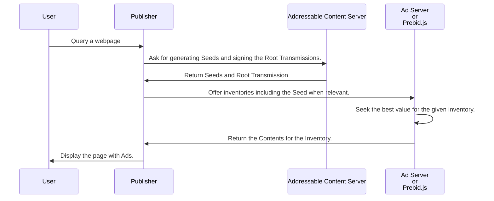
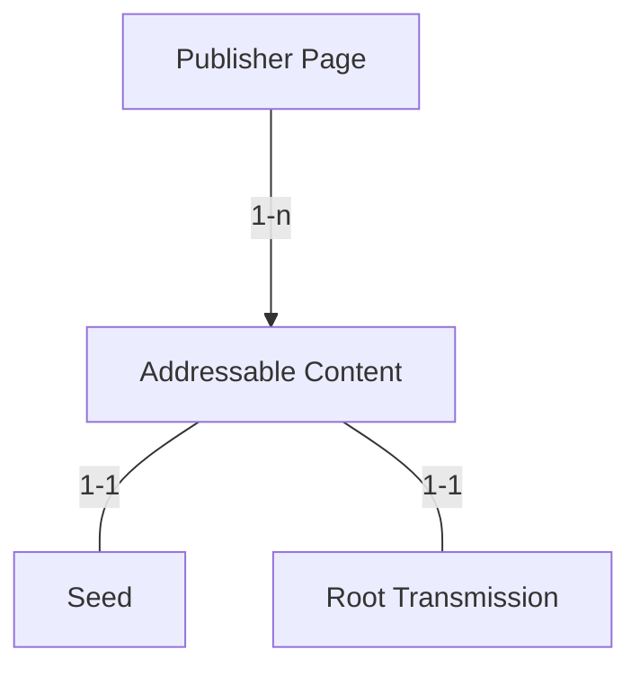

# Web site implementation

## Advertiser

Assumptions:

- it's ok to have backend implementation for advertisers

### User preferences

MVP: Redirect

- integration with operator: backend

- note: data can be used but not shared (otherwise, a transmission is needed)

JSON

- later

## Publisher

### User preferences

Redirect

- operator integration

JSON

### Inventory offer

#### Overview

A Publisher delegates the signatures of the Seeds and the Root Transmission
request to an *Addressable Content Server* before offering it as an inventory.
As a reminder, a Seed is the signed aggregation of Addressable Contents with
the Prebid SSO Data.



Note that each placement has a Seed and a Root Transmission request.



#### Addressable Content Server Endpoint

The Publisher must call the Addressage Content Server Endpoint with the
Prebid SSO Data stored into the cookies of the User. It must consider the
cookie as an URL encoded raw data and send it as it is.

It must reach the following endpoint:
```
/v1/transmission
``` 
The following parameters must be sent in JSON in the payload of a POST request:

| Field    | Type                      | Details                               |
|----------|---------------------------|---------------------------------------|
| count    | Integer                   | Number of Addressable Contents                               |
| cookies  | Array of Cookies values   | All the cookies related to the Prebid Addressable Framework |

Example: 

```json
{
    "count": 2,
    "cookies": [
        <cookie 1>,
        <cookie 2>,
    ]
}
```

The response will be composed of the following:

| Field    | Type                      | Details                               |
|----------|---------------------------|---------------------------------------|
| seeds    | Array of Seeds            | Seeds that are going to be used to transmit SSO Data for each Addressable Content. |


<!--partial-begin { "files": [ "seed-table.md" ] } -->

The Seed represents the aggregation of the Pseudonymous-Identifiers and the
Preferences of the user for a given content. 

| Field                  | Type                                     | Details  |
|------------------------|------------------------------------------|----------|
| version                | Number                                   | The Prebid SSO version of the object.|
| transaction_id         | String                                   | A GUID in a String format dedicated to the share of the Prebid SSO data for one Addressable Content.|
| preferences            | Preferences object                       | The Preferences of the user.|
| identifiers            | Array of Pseudonymous-Identifier objects | The Pseudonymous-Identifiers of the user. For now, it only contains a Prebid ID.|
| source                 | Source object                            | The source contains data for identifying and trusting the Publisher.<br /><table><tr><th>Field</th><th>Type</th><th>Details</th></tr><tr><td>domain</td><td>String</td><td>The domain of the Root Party (Publisher in most of the cases).</td></tr><tr><td>timestamp</td><td>Integer</td><td>The timestamp of the signature.</td></tr><tr><td>signature</td><td>String</td><td>Encoded signature in UTF-8 of the Root Party/Publisher.</td></tr></table>|
<!--partial-end-->

<!--partial-begin { "files": [ "preferences-table.md" ] } -->
The Preferences object list all the preferences of a user in a dictionary. For
now, there is only one preference ("opt-in").

| Field   | Type                   | Details                                   |
|---------|------------------------|-------------------------------------------|
| version | Number                 | The Prebid SSO version of the object.     |
| data    | Dictionary             | The key is a string and represents the name of the preference. <br /> The values represent the value of the preference. <br /> For now there is only one preference named "optin" and its value is a boolean.|
| source  | Source object          | The source contains the data for identifying and trusting the CMP that signed lastly the Preferences.<br /> <table><tr><th>Field</th><th>Type</th><th>Details</th></tr><tr><td>domain</td><td>String</td><td>The domain of the CMP.</td></tr><tr><td>timestamp</td><td>Integer</td><td>The timestamp of the signature.</td></tr><tr><td>signature</td><td>String</td><td>Encoded signature in UTF-8 of the CMP.</td></tr></table>|
<!--partial-end-->

<!--partial-begin { "files": [ "identifier-table.md" ] } -->
The Pseudonymous-Identifier object represent one identifier for the user. For
now, there is one type possible ("prebid_id").

| Field   | Type          | Details                                            |
|---------|---------------|----------------------------------------------------|
| version | Number        | The version of Prebid SSO used for signing the Identifier.                                                                       |
| type    | String        | The type of Pseudonymous-Identifier. For now, there is only one: "prebid_id".                                                    |
| value   | String        | The Pseudonymous-Identifier value in UTF-8.                                                                                      |
| source  | Source object | The Source contains all the data for identifying and trusting the Operator that generated the Pseudonymous-Identifier. <br /> <table><tr><th>Field</th><th>Type</th><th>Details</th></tr><tr><td>domain</td><td>String</td><td>The domain of the Operator.</td></tr><tr><td>timestamp</td><td>Integer</td><td>The timestamp of the signature.</td></tr><tr><td>signature</td><td>String</td><td>Encoded signature in UTF-8 of the Operator.</td></tr></table>|
<!--partial-end-->

Example:
<!--partial-begin { "files": [ "seed.json", "body-id-and-preferences.json" ], "jq": "{ seeds: [ .[0] , .[0]  ] } +  .[1]  | .seeds[1].transaction_id += 1" } -->
```json
{
  "seeds": [
    {
      "version": 0,
      "transaction_id": 1234567,
      "source": {
        "domain": "publisher.com",
        "timestamp": 1639582000,
        "signature": "12345_signature"
      }
    },
    {
      "version": 0,
      "transaction_id": 1234568,
      "source": {
        "domain": "publisher.com",
        "timestamp": 1639582000,
        "signature": "12345_signature"
      }
    }
  ],
  "body": {
    "preferences": {
      "version": 1,
      "data": {
        "opt_in": true
      },
      "source": {
        "domain": "cmpC.com",
        "timestamp": 1639643112,
        "signature": "preferences_signature_xyz12345"
      }
    },
    "identifiers": [
      {
        "version": 1,
        "type": "prebid_id",
        "value": "7435313e-caee-4889-8ad7-0acd0114ae3c",
        "source": {
          "domain": "operator0.com",
          "timestamp": 1639643110,
          "signature": "prebid_id_signature_xyz12345"
        }
      }
    ]
  }
}
```
<!--partial-end-->

#### Offering inventory with an Ad Server solution


#### Offering inventory with Prebid.js


##

## CMP

## 


